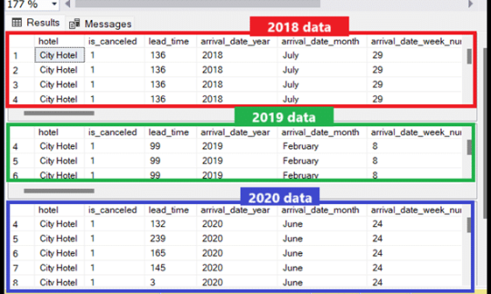
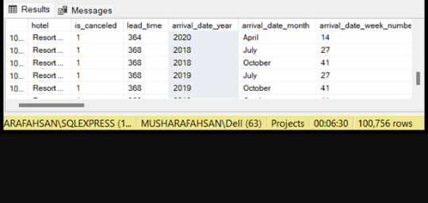

# Hotel-Data-Analysis Project 


## Objective 

- What is the key pain point? 

The Hotel manager wants to know is under a lot of pressure. She wants to know if the hotel has been making profits or lossess for the 3 concercutive years 2018, 2019 and 2020. She needs this information ASAP to present it to the stakeholders. She wants to know also if the hotel should increase it's parking lot size by identifying the trend in customers with cars.


- What is the ideal solution? 

To create a dashboard that provides insights into the hotel's profit margins for the year 2018, 2019 and 2020. The dashboard should include metrics such as customer details.
- years
- revenue
- customer details.

This will help the hotel manager to maje informed decisions on areas of improvements.
### Steps to follow 
- Identify the hotel profit margins.
- Gather data on the years, hotel type, customer details such as if the customer has a car or not, the customer age group, gender etc to identify trends.
  
# User story 

As the Hotel manager, I want to use a dashboard to see if the hotel has been makig profits or lossess for the years 2018, 2019 and 2020. I also want to know if we should increase our parking lot size to accommodate customers with cars if there is a trend im customers with cars. I want to see other trends of data that I might have missed out. 

This dashboard should allow me to identify the revenue based on metrics like profit margins. 

With this information, I can make more informed decisions on areas of possible improvements. I will get to see why there has been a drop or an increase to maintain consistency.


# Data source 

- What data is needed to achieve our objective?

We need the hotel data for the years 2018 to 2020. The data should include metrics such as;
- years
- hotel type
- country
- age group
- customer type
- required car parking
- requests
- reservations
- bookings
- meal costs
- deposits
- fees
- arrival day
- departure day
- stay in


- Where is the data coming from? 
The data is sourced from Kaggle, [see here to find it.](
https://www.kaggle.com/datasets/bhavyadhingra00020/top-100-social-media-influencers-2024-countrywise?resource=download)

# Stages

- Design
- Developement
- Testing
- Analysis 
 


# Design 

## Dashboard components required 
- What should the dashboard contain based on the requirements provided?

To understand what it should contain, we need to figure out what questions we need the dashboard to answer:

1. Who are the top 10 YouTubers with the most subscribers?
2. Which 3 channels have uploaded the most videos?
3. Which 3 channels have the most views?
4. Which 3 channels have the highest average views per video?
5. Which 3 channels have the highest views per subscriber ratio?
6. Which 3 channels have the highest subscriber engagement rate per video uploaded?

For now, these are some of the questions we need to answer, this may change as we progress down our analysis. 


## Dashboard mockup

- What should it look like? 

Some of the data visuals that may be appropriate in answering our questions include:

1. Table
2. Treemap
3. Scorecards
4. Horizontal bar chart 

## Tools 


| Tool | Purpose |
| --- | --- |
| Excel | Exploring the data |
| SQL Server | Cleaning, testing, and analyzing the data |
| Power BI | Visualizing the data via interactive dashboards |
| GitHub | Hosting the project documentation and version control |


# Development

## Pseudocode

- What's the general approach in creating this solution from start to finish?

1. Get the data
2. Explore the data in Excel
3. Load the data into SQL Server
4. Clean the data with SQL
5. Test the data with SQL
6. Visualize the data in Power BI
7. Generate the findings based on the insights
8. Write the documentation + commentary
9. Publish the data to GitHub Pages

## Data exploration notes

This is the stage where you have a scan of what's in the data, errors, inconcsistencies, bugs, weird and corrupted characters etc  


- What are your initial observations with this dataset? What's caught your attention so far? 

1. There are at least 5 spreadsheets in the file. I do not need to contact my client for more data. One spreadsheet contains the data for 2018, another one contains data for 2019, the other has data for 2020 and the other spreadsheets have meals cost and market segment respectively.
2. The are 32 colums in the 2018, 2019 and 2020 spreadsheets, I have more than enough information that I will need for my analysis and visualization.
3. Some of the cells have null values.
4. We have more data than we need, so some of these columns would need to be removed.
5. There is consistensy in variable types.

   ## Data cleaning 
- What do we expect the clean data to look like? (What should it contain? What contraints should we apply to it?)

The aim is to refine our dataset to ensure it is structured and ready for analysis. 

The cleaned data should meet the following criteria and constraints:

- Only relevant columns should be retained.
- All data types should be appropriate for the contents of each column.
- No column should contain null values, indicating complete data for all records.

Below is a table outlining the constraints on our cleaned dataset:

| Property | Description |
| --- | --- |
| Number of Rows | 21997 |
| Number of Columns | 32 |

And here is a tabular representation of the expected schema for the clean data:

| Column Name | Data Type | Nullable |
| --- | --- | --- |
| hotel| VARCHAR | NO |
| is cancelled | INTEGER | NO |
| arrival date  | INTEGER | NO |
| total_videos | INTEGER | NO |
|stay in week night|INTEGER| NO|
|Adults| INTEGER| NO|
|CHILDREN| INTEGER| NO|
|Babies| INTEGER| NO|
|Meal| VARCHAR| NO|
|COUNTRY|VARCHAR|NO|


- What steps are needed to clean and shape the data into the desired format?

1. Remove unnecessary columns by only selecting the ones you need

# Create A Database
I will be creating a database in SQL Server Management Studio for futher analysis of the Hotel Booking Data.


# Querying the Data
## Exploring The Data

```sql
/*
# 1. Select the required columns
# 
*/

-- 1.
SELECT * from dbo.
['2018$']
SELECT * from dbo.
['2019$']
SELECT * from dbo.
['2020$']
```
Data display.


## Combining the data

```sql
/*
# Combine the data of the 3 tables
*/

-- 1.
SELECT * from dbo.
['2018$']
union
SELECT * from dbo.
['2019$']
union
SELECT * from dbo.
['2020$']
```
## Result


# Testing 
- What data quality and validation checks are you going to create?

Here are the data quality tests conducted:

## Row count check
```sql
/*
# Count the total number of records (or rows) are in the SQL view
*/

SELECT
    COUNT(*) AS no_of_rows
FROM
    dbo.;

```
## Column count check
### SQL query 
```sql
/*
# Count the total number of columns (or fields) are in the SQL view
*/


SELECT
    COUNT(*) AS column_count
FROM
    INFORMATION_SCHEMA.COLUMNS
WHERE
    TABLE_NAME = 'dbo.'
```
## Data type check
### SQL query 
```sql
/*
# Check the data types of each column from the view by checking the INFORMATION SCHEMA view
*/

-- 1.
SELECT
    COLUMN_NAME,
    DATA_TYPE
FROM
    INFORMATION_SCHEMA.COLUMNS
WHERE
    TABLE_NAME = 'dbo.';
```
## Duplicate count check
### SQL query 
```sql
/*
# 1. Check for duplicate rows in the view
# 2. Group by the channel name
# 3. Filter for groups with more than one row
*/

-- 1.
SELECT
   customer ,
    COUNT(*) AS duplicate_count
FROM
    dbo.

-- 2.
GROUP BY
    customer

-- 3.
HAVING
    COUNT(*) > 1;
```
# Exploratory Data Analysis
 I am going to apply EDA on the data and try to answer the followinh question.
 1. Is the hotel revenue growing yearly?
 2. Should the team increase their parking lot size?
 3. What trend can be seen in the data?
     Testing 
- What data quality and validation checks are you going to create?

Here are the data quality tests conducted:


```sql
/*
# Create a temporary table with all the data combined.
*/

with hotels as ( select * from dbo.
['2018$']
union
SELECT from dbo.
['2019$']
union
SELECT from dbo.
['2020$'])
SELECT * from hotels
```

## Q1: IS THE HOTEL REVENUE GROWING YEARLY?
In the dataset there is no revenue column but there is average daily rate (adr), stay_in_week_nights and stay_in_weekend_nights.


```sql
/*
# Create a revenue column by using the adr, stay_in_weekend_nights and stay_in_week_nights.
*/
select ( stay_in_week_nights + stay_in_weekend_nights) * adr
as revenue from hotels

```
